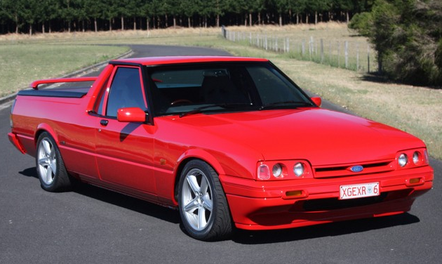

#  Power Windows 
Arduino project to add power window control to 'old' car

Electronic control for vehicle originally with manual window winders,
and motorised actuators retofitted.

My case is for 2 door utility (ute). So require 4 relays, 2 up/down switches required.
See proposed included schematic.  
 
  

Proposed schema:  
Mount 2 switches on centre console and arduino and 4 relay board and current sense boards nearby and run 1 pair wires 
  carrying drive current to each door.
  
  Momentarially operating a Left or Right switch (or both) should drive in the correct direction until either.  
  The winding is  
    1. Halted by user  ie momentary action of (either) switch  
    2. Window reaches maximum travel and halts due to current   sense  
    3. Timed-out after a fixed period. (For circumstance where window is slow but not tripping overcurrent)  
    
  Holding switch operated should  
    1. Not block operation of other user  
    2. Operate window winding in desired direction until either  
      &nbsp;&nbsp;a. Timeout occurs  
      &nbsp;&nbsp;b. User releases switch  
      
References:  
  https://www.youtube.com/watch?v=-DV6hUSxZSk   Arduino power Window control conversion  
  https://www.youtube.com/watch?v=lisprJs5sNU   Using ACS712 Hall effect current sensor  
   
  float a =((float) sensorValue / 512.0 - 1.0) * 2.5 / 2 * 20;  
  source: forum.arduino.cc/index.php?topic=143265.0  
   
  4 relay board https://www.aliexpress.com/item/32905958885.html?spm=a2g0s.9042311.0.0.27424c4dgulU3c  
  current sensor https://www.aliexpress.com/item/4000205887443.html?spm=a2g0s.9042311.0.0.19764c4dDLUdVT
   
lawabb@gmail.com  
Version 0.2  - Rewrite to not require interrupts. Have no current sense hardware as yet.. no tested code for it yet.  
Version 0.3  - Have no current sense hardware as yet, but code for it added untested.  
&nbsp;&nbsp; TODO - code for remote operation  
&nbsp;&nbsp; TODO - refactor code... there is plenty of code duplication  